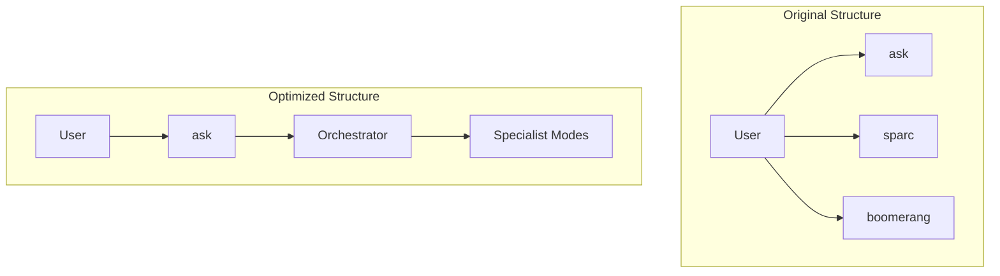

# roomode-advanced
The roomode-advanced repository is a powerful and flexible workspace template designed specifically for developers using Roo Code. It provides an optimized environment to streamline project development through SPARC orchestration and AI-assisted workflows in Visual Studio Code (VS Code).

This repository introduces enhanced modes that make it easier to develop, manage, and maintain your projects efficiently. By leveraging persistent project context and fine-tuned mode interactions, it minimizes token consumption while maximizing productivity.

**In short, this repository combines RooFlow's memory bank + RooFlow's boomerang mode + SPARC Orchestration modes (including memory bank).**

---

## Credits
This workspace was created by **Enes Çingöz**.

This project builds upon the work of:
- **RooFlow (0.3.6)**: https://github.com/GreatScottyMac/RooFlow
- **roocode-modes**: https://github.com/enescingoz/roocode-modes
- An article by Reuven Cohen on Boomerang Tasks: https://www.linkedin.com/pulse/boomerang-tasks-automating-code-development-roo-sparc-reuven-cohen-nr3zc

---

## Usage
### Requirements
- Vscode as an editor

### Quick Setup (Single File)

If you only want to use the custom modes without cloning the entire repository, you can download the `.roomodes` file directly into your project's root directory.

**Using curl:**
```bash
curl -o .roomodes https://raw.githubusercontent.com/benzntech/roocode-workspace/main/.roomodes
```

**Using wget:**
```bash
wget -O .roomodes https://raw.githubusercontent.com/benzntech/roocode-workspace/main/.roomodes
```

---
### Instructions
1. **Create a Repository from Template**  
   Click the `Use this template` button located at the top-right of the [repository page](https://github.com/benzntech/roocode-workspace). This will allow you to create a new repository based on the template. 
  
2. **Initialize Your Project Repository**  
   After selecting the template, click the `Create a new repository` button to generate your own repository for the project.

3. **Automatic Setup**  
   All RooCode SPARC modes, RooFlow's boomerang mode and memory bank configurations will be automatically added to your project.

4. **Clone and Open in VS Code**  
   Clone your newly created repository to your local machine and open it in Visual Studio Code.

5. **Select RooCode Mode**  
   In RooCode, navigate to the bottom-left corner and select your desired mode. For first-time use, choose *Architect Mode*.

6. **Initialize Memory Bank**  
   If this is your first time setting up the project, start by entering the command `initialize memory bank` in RooCode chat. This will automatically create a folder named `memory_bank` in your repository and generate necessary files within it.

7. **Continue Development**  
   Proceed with your project development as desired while using the implemented modes. The memory bank will automatically update to reflect changes in your project.

8. **Force Synchronization**  
   At any point, you can type `Update Memory Bank` or `UMB` in RooCode chat to manually synchronize the session’s information with the memory bank. This ensures continuity across sessions or before switching modes.

---

## Modes

### ⚡️ Orchestrator
**Role:** A strategic workflow orchestrator who breaks down complex tasks and delegates them to specialized modes.
**Focus:** Secure, modular, testable, and maintainable delivery using advanced reasoning models.

---

### 📋 Specification & Pseudocode
**Role:** Translates project requirements into modular pseudocode with TDD anchors.
**Focus:** Clear, modular design; externalizes configuration; splits complex logic across modules.

---

### 🏗️ Architect
**Role:** Designs scalable, secure, and modular architectures based on requirements and pseudocode.
**Focus:** Detailed system diagrams, data flows, API boundaries, and service segmentation.

---

### 🧠 Code
**Role:** Implements robust, efficient code using externalized configurations.
**Focus:** Clean, modular code split into files under 500 lines, with no hard-coded secrets.

---

### 🧪 TDD
**Role:** Enforces Test-Driven Development by writing failing tests first and then minimal code followed by refactoring.
**Focus:** Thorough test coverage, modular test files, and adherence to security practices.

---

### 🪲 Debug
**Role:** Troubleshoots and resolves runtime issues using logging, tracing, and analysis tools.
**Focus:** Isolates and fixes bugs while keeping fixes modular and secure.

---

### 🛡️ Security Reviewer
**Role:** Audits code and architecture to identify vulnerabilities and enforce secure practices.
**Focus:** Detects exposed secrets, oversized files, and non-modular code, recommending necessary mitigations.

---

### 📚 Documentation Writer
**Role:** Produces clear, comprehensive Markdown documentation for usage, configuration, and integration.
**Focus:** Modular documentation (files under 500 lines) that avoids exposing sensitive data.

---

### 🔗 Integrator
**Role:** Merges outputs from all specialized modes into a cohesive final product.
**Focus:** Seamless integration of components ensuring modularity and adherence to security standards.

---

### 📈 Post-Deployment Monitor
**Role:** Monitors system performance post-deployment, collecting metrics, logs, and user feedback.
**Focus:** Continuous monitoring with secure, modular configurations and prompt escalation of issues.

---

### 🧹 Optimizer
**Role:** Continuously refines and optimizes the codebase for performance, modularity, and maintainability.
**Focus:** Refactoring, splitting large files, and externalizing configurations to meet best practices.

---

### ❓ Ask
**Role:** Guides users in formulating precise, modular requests to delegate tasks to the correct specialized modes.
**Focus:** Providing task formulation and delegation strategies for effective inquiries.

---

### 🚀 DevOps
**Role:** Manages deployments and infrastructure operations across cloud providers, edge platforms, and internal environments.
**Focus:** Secure, traceable, and automated deployments using CI/CD pipelines and managed configuration with no hard-coded credentials.

---

### 📘 SPARC Tutorial
**Role:** Guides new users through the SPARC development process using structured thinking models and clear task delegation with `new_task`.
**Focus:** Educates on modular project setup, best practices (no hard-coded environment variables; files under 500 lines), and effective mode-to-mode handoffs with concise completions via `attempt_completion`.

---
## Configuration Optimization (Token Usage Improvement)

To improve performance, maintainability, and reduce token consumption, the `.roomodes` configuration has been optimized. This "fork" of the original configuration focuses on consolidating redundant instructions and clarifying the roles of each mode.

### The Problem: Redundancy and Verbosity

The original `.roomodes` file contained significant repetition across mode definitions:
- **Repeated Instructions**: Common rules about file size limits (`< 500 lines`), use of `attempt_completion`, and prohibitions on hardcoding secrets were repeated in many modes.
- **Verbose Definitions**: Role definitions and custom instructions were lengthy.
- **Overlapping Roles**: Orchestrator modes like `sparc` and `boomerang` had similar functions.

### The Solution: A Streamlined Approach

The optimization plan is based on the following principles:

1.  **Core Principles**: A set of common rules is established and referenced, rather than repeated. These are:
    *   **Modularity**: Keep files under 500 lines.
    *   **Security**: Never hardcode secrets or environment variables.
    *   **Clarity**: Use `attempt_completion` to signal completion with a clear summary.
    *   **Delegation**: Use `new_task` to delegate subtasks to other modes.

2.  **Consolidated Orchestration**: The `sparc` and `boomerang` modes are merged into a single, primary orchestrator to simplify the workflow.

3.  **Concise Instructions**: Each mode's instructions are rewritten to be direct and focused on its unique responsibilities.

### Visualizing the New Workflow

This diagram illustrates the simplified mode hierarchy:



This streamlined approach reduces complexity and makes the development workflow more intuitive.

---

## 📚 Memory Bank Structure
The Memory Bank is a directory named `memory-bank` located in your project's root. It contains several Markdown files that store different aspects of your project's knowledge:

| File                 | Purpose                                                                                                                               |
| -------------------- | ------------------------------------------------------------------------------------------------------------------------------------- |
| `activeContext.md`   | Tracks the current session's context: recent changes, current goals, and open questions/issues.                                       |
| `decisionLog.md`     | Records architectural and implementation decisions, including the context, decision, rationale, and implementation details.        |
| `productContext.md`  | Provides a high-level overview of the project, including its goals, features, and overall architecture.                             |
| `progress.md`        | Tracks the progress of the project, including completed work, current tasks, and next steps.  Uses a task list format.               |
| `systemPatterns.md` | (Optional) Documents recurring patterns and standards used in the project (coding patterns, architectural patterns, testing patterns). |

roocode-workflow automatically manages these files. You generally don't need to edit them directly, although you can review them to understand the AI's knowledge.

---

## License
[Apache 2.0](https://github.com/benzntech/roocode-workspace/blob/main/LICENSE)
